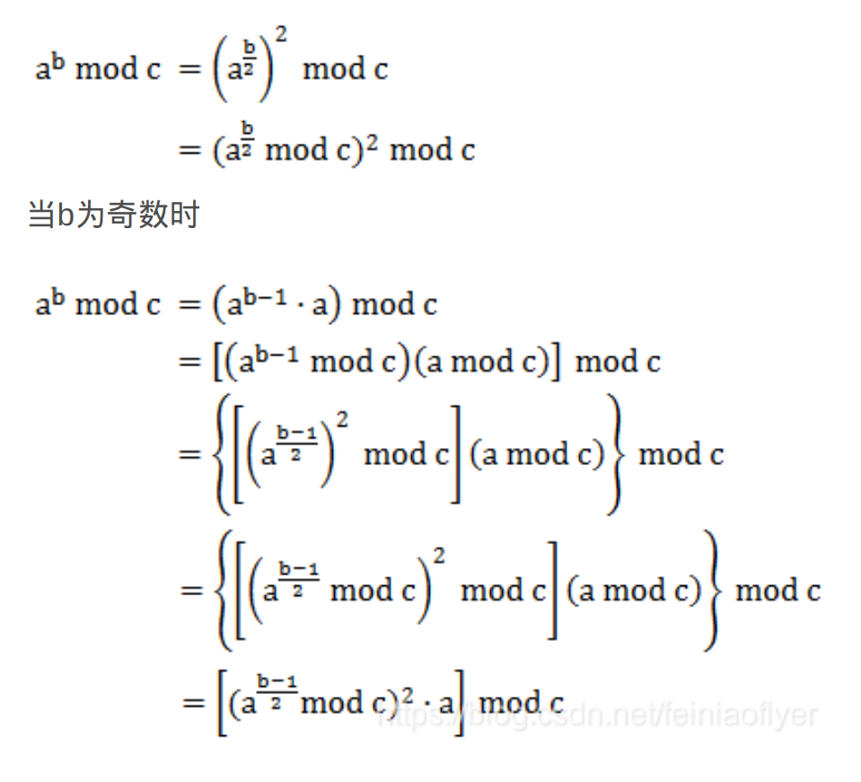
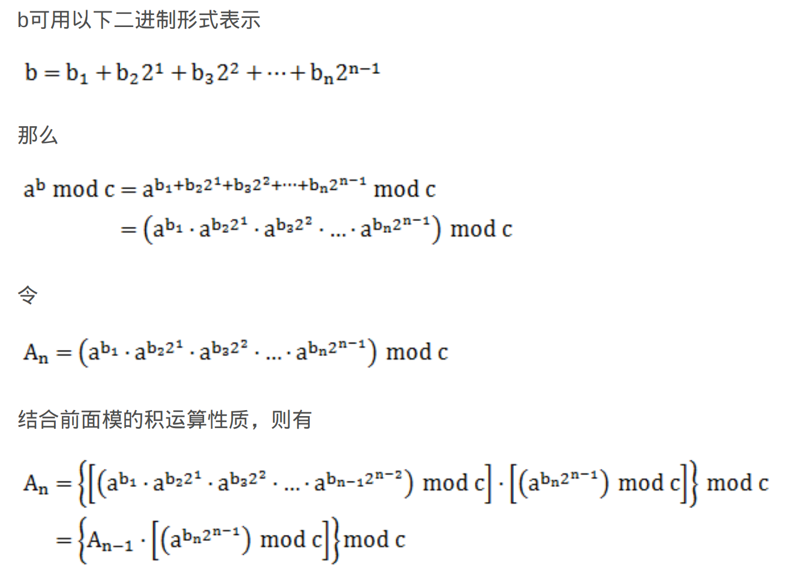
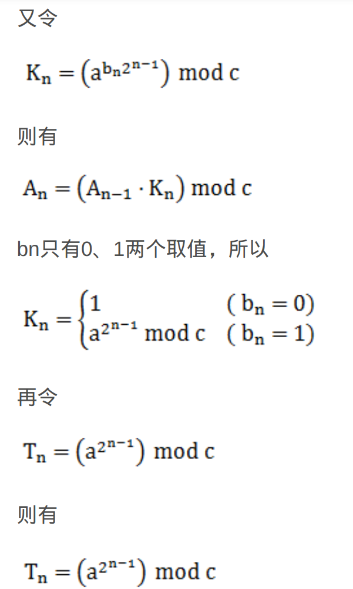
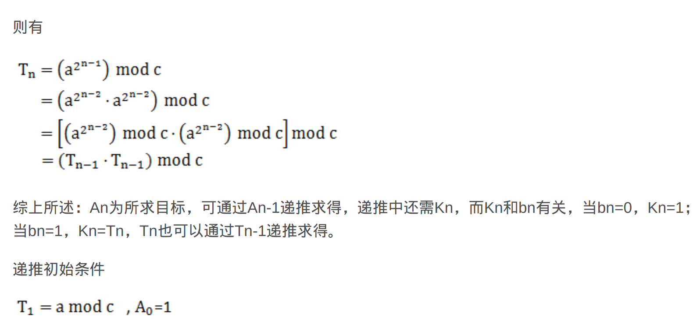

# 一些基础算法

****

### 快速幂

参考代码[quickMi](./src/quickMi.cpp)

###### 递归法

###### 蒙哥马利法

######  

### 排序

###### Selection sort

==定义==：每次找出第i小的元素，然后将这个元素与数组第i个位置元素互换。

==稳定性==：不稳定

==时间复杂度==：最优，平均，最坏均为O（n2）。

代码参考[sort.cpp](./src/sort.cpp)

###### bubble sort

==定义==：在算法执行过程中较小的元素像是气泡一样浮到数列的顶端所以叫作冒泡排序。每次检查相邻的两个元素，如果两元素满足排序条件就交换。

==稳定性==： 稳定

==时间复杂度==：

- 最优情况：O(n)
- 最坏情况：O(n2)
- 平均时间复杂度：O(n2)

代码参考[sort.cpp](./src/sort.cpp)

